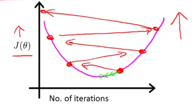

# Linear Regression with multiple variables

## Multivariate Linear Regression 

### Multiple features (variables)
+ Examples:
    
    

    - Notation: 
        - n: number of features
        - m: number of training examples
        - $x^{(i)}$: input (features) of $i^{th}$ training example
        - $x^{(i)}_{j}$: value of feature *j* in $i^{th}$ training example

+ Remark:
    - Hypothesis for single feature: $h_{\theta}(x) = \theta_{0} + \theta_{1}x$
    - Hypothesis for multiple features: $h_{\theta}(x) = \theta_{0} + \theta_{1}x_{1} + \theta_{2}x_{2} + ... + \theta_{n}x_{n}$
    - For convenience of notation:

        $X = \begin{bmatrix}
                x_{0} \\[0.3em]
                x_{1} \\[0.3em]
                ...   \\[0.3em]
                x_{n} 
             \end{bmatrix}$

        $\theta = \begin{bmatrix}
                    \theta_{0} \\[0.3em]
                    \theta_{1} \\[0.3em]
                    ...   \\[0.3em]
                    \theta_{n} 
                  \end{bmatrix}$

        $h_{\theta}(x) = \theta_{0}x_{0} + \theta_{1}x_{1} + ... + \theta_{n}x_{n} = \theta^{T}X$                  
    
+ Gradient Descent for Multiple Variables:
    - Hypothesis:

        $h_{\theta}(x) = \theta_{0}x_{0} + \theta_{1}x_{1} + ... + \theta_{n}x_{n} = \theta^{T}X$
    
    - Parameters:

        $\theta_{0}, \theta_{1}, ..., \theta_{n}$ 
    
    - Cost function:

        $J(\theta_{0}, \theta_{1}, ..., \theta_{n}) = \frac{1}{2m} \sum_{i=1}^{m}((\sum_{j=0}^{n}\theta_{j}x_{j}^{(i)}) -y^{(j)})^{2} = \frac{1}{2m} \sum_{i=1}^{m}(h_{\theta}(x^{(i)}) -y^{(i)})^{2}$

    - Repeat until convergence:

        $\theta_{j} := \theta_{j} - \alpha\frac{1}{m}\sum_{i=1}^{m}(h_{\theta}(x^{(i)}) -y^{(i)}).(x^{(i)})$ , with n >= 1

        (simultaneously update $\theta_{j}$ for j = 0, 1, ..., n)

### Gradient Descent in Practice 
+ The pratical tricks for making gradient descent work well.

#### Feature Scaling 
+ Idea: Make sure features are on a similar scale.
    - Difference features take on *similar range of values*
    - Goal: the gradient descent can converge more quickly.

+ Example:
    - Input: 
        - feature 1: house size (0 - 2000) $feet^{2}$
        - feature 2: number bedroom (1 - 5)
    - Process:
        - Normalization & standardization dataset:
            - $x_{1} = \frac{house size}{2000}$
            - $x_{2} = \frac{number bedroom}{5}$
        - **Mean normalization**: 
            - Formal:
                $x_{i} := \frac{x_{i} - \mu_{i}}{s_{i}}$

                - $\mu_{i}$ is avg value of $x_{1}$ of training set.
                
                - $s_{i}$: range = max - min (or standard deviation)

            - $x_{1} = \frac{size - 1000}{2000}, -0.5 \leq x_{i} \leq 0.5$

            - $x_{2} = \frac{number_bedroom - 2}{5}, -0.5 \leq x_{i} \leq 0.5$

+ More generally, get every feature into approximately a $-1 \leq x_{i} \leq 1$
    - range(-1, 1) not important.

### Learning Rate
+ Gradient descent:
    $\theta_{j} := \theta_{j} - \alpha\frac{\partial}{\partial\theta_{j}}J(\theta)$

    - How to make sure gradient descent is working correctly ?
    - How to choose learning rate ? 

+ Make sure gradient descent is working correctly.
    - The cost function *should* decrease after every iterations.

    - Case 1: gradient descent values increase -> *clear sign* gradient descent not working. Propose:
        - check the logic of code correctly.
    
        

    - Case 2: gradient descent look like . Propose:
        - use smaller learning rate.

        

    - Case 3: gradient descent look like . Propose:
        - use smaller learning rate.

        

    

+ Summary:
    - If $\alpha$ too small -> slow convergence.
    - If $\alpha$ too large -> gradient descent may not decrease on every iteration & may not convergence.

### Features and Polynomial Regression
+ Goals:
    - The choice of (appropriate) features that you have  & how can get different learning algorithm.
    - Polynomial regression allows using linear regression to fit complicated, even non-linear functions.

+ Examples:
    - Housing prices prediction: 
    
    $h_{\theta}(x) = \theta_{0} + \theta_{1}.frontage + \theta_{2}.depth$

## Computing Parameters Analytically

### Normal equation 
+ Goals: 
    - Provide a better solution for some linear regression problems.
    - Method to solve for $\theta$ analytically without using Gradient Descent.
    - An effective & time-saving option when working with a datasets with **small features**.

+ More details about Normal Equation, check Topic 7 in questions.md.

+ Intuition: if 1-D, cost function:

    $J(\theta) = a\theta^{2} + b\theta + c$

    - ? To minimize a quadratic function:  
        - Take derivatives & set equal to 0
        - analysis extreme values 
    
+ Consider more complex problem, $\theta = (\theta_{0}, \theta_{1}, ..., \theta_{m})$:
    - Take the partial derivative of $J(\theta_{j})$ & set equal to 0
    - Solve for $\theta_{0}$ to $\theta_{n}$
    - Give the values of $\theta$ whichh minimize $J(\theta)$

+ Example:
    - m: examples $(x^{(1)}, y^{(1)}), ..., (x^{(m)}, y^{(m)})$
        
        - $x^{(i)} = \begin{bmatrix}
                       x_{0}^{(i)} \\[0.3em]
                       x_{1}^{(i)} \\[0.3em]
                       .
                       .
                       .
                       x_{n}^{(i)} \\[0.3em]
                     \end{bmatrix}
          $

+ Normal Equation Formal:
    $\theta = (X^{T}X)^{-1}X^{T}y$

+ Compare Gradient Descent & Normal Equation

    - *m*: training examples & *n* : features.

|Gradient Descent   |Normal Equation   |
|---|---|
|Need to chose $\alpha$   |No need to chose $\alpha$  |
|Need many iterations   |No need to iterate   |
|Works well even when n is large   |Need to compute $(X^{T}X)^{-1}$   |
|   |Slow if *n* is very large, $n \leq 1000$|

### Normal equation and non-invertibility (optional)
+ Problems:
    - What if $X^{T}X$ is non-invertible ? (singular/degenerate   )

+ Solve:
    - Redundant features (linearly dependent), where 2 features are very closely related.
    - Too many features (e.g. $m \leq n$)
        - Delete some features or use regularization

