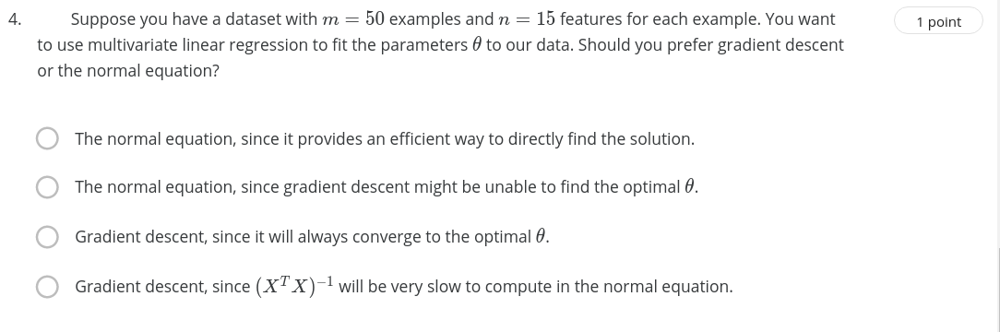

# Quiz 1

+ Analysis:
    - The normalized feature (min-max scaling): 
        - A scaling technique in which values are **shifted** and **rescaled** 
        - Range: $0 \leq nor_feature \leq 1$
        - Formal: 

            $X^{'} = \frac{X_{i}^{(j)} - \mu}{s}$

            - $X_{i}^{(j)}$: the input feature
            - $\mu$: mean of the feature X
            - s: as the **standard deviation** of the feature or range of the feature (max - min).
+ Solve:
    - $\mu = (89+72+94+69)/4 = 81$
    - $s = 94 - 69 = 25$
    - $X_{i}^{(j)} = 94$
    - $x^{'}=0.52$

# Quiz 2

A: If the learning value equal 1.0, so too large.
B: Seem this value is correctly
C: So decrease the learning rate 

Seem this value is correctly

# Quiz 3

+ Consider, m = 23 training examples & n = 5 features:
    - X: design matrix (m x (n + 1))
    - $X^{T}: (6, 23)$ -> $(X^{T} X)^{-1}: (6, 23)x(23, 6) ~ (6, 6)$
    - $(X^{T} X)^{-1} X^{T}: (6, 6), (6, 23) = (6, 23)}
    - y: (23, 1)
    - $\theta: (6, 23) x (23, 1) = (6, 1)$

# Quiz 4
