# Neural Networks and Deep Learning

## Table of contents

- [Neural Networks and Deep Learning](#neural-networks-and-deep-learning)
  - [Table of contents](#table-of-contents)
  - [Introduction to deep learning](#introduction-to-deep-learning)
    - [What is a (Neural Network) NN?](#what-is-a-neural-network-nn)
    - [Supervised learning with neural networks](#supervised-learning-with-neural-networks)
    - [Why is deep learning taking off?](#why-is-deep-learning-taking-off)
  - [Neural Networks Basics](#neural-networks-basics)
    - [Binary classification](#binary-classification)
    - [Logistic Regression](#logistic-regression)
    - [Logistic Regression cost function](#logistic-regression-cost-function)
    - [Gradient Descent](#gradient-descent)
    - [Derivatives](#derivatives)
    - [Computation Graph](#computation-graph)
    - [Derivatives with a computation graph](#derivatives-with-a-computation-graph)
    - [Logistic Regression Gradient Descent](#logistic-regression-gradient-descent)
    - [Gradient Descent on *m* Examples](#gradient-descent-on-m-examples)
  - [Shallow neural networks](#shallow-neural-networks)
    - [Neural Networks Overview](#neural-networks-overview)
    - [Neural Networks Representation](#neural-networks-representation)
    - [Computing a Neural Network's Output](#computing-a-neural-networks-output)
    - [Vectorizing across multiple examples](#vectorizing-across-multiple-examples)
    - [Activation functions](#activation-functions)
    - [Why do you need non-linear activation functions ?](#why-do-you-need-non-linear-activation-functions-)
  - [Gradient descent for Neural Networks](#gradient-descent-for-neural-networks)
- [Reference:](#reference)

## Introduction to deep learning

### What is a (Neural Network) NN?
- Neural networks are comprised of a node layers, containing:
    - An input layer includes input features.
    - One or more hidden layers includes hidden units
    - An output layer

- Consider "Housing Price Prediction" example:

    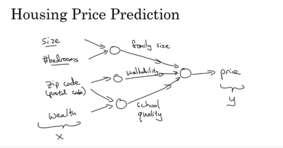

    - 4 input features: size, number of bedrooms, zip code & wealth.
    - 3 hidden units: family size, walk ability & school quality.
    - predict the price

- Deep Neural Networks consists of more hidden layers:

    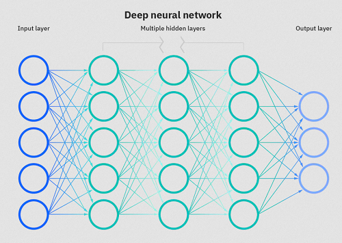

### Supervised learning with neural networks
- Supervised learning: 
    - use labeled datasets to train algorithms that to predict outcomes accurately or classify data.
    - Labeled datasets includes data & label identifying certain properties.

- Supervised learning examples & applications:

    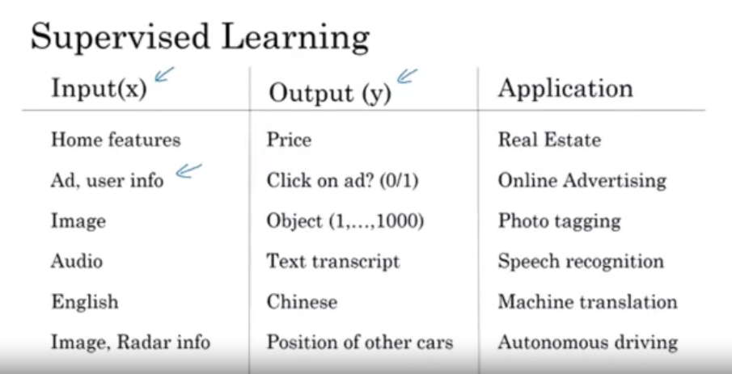

- Different types of neural networks for supervised leaning:
    - **C**onvolutional **N**eural **N**etworks (useful in Computer Vision)
    - **R**ecurrent **N**eural **N**etworks (useful in Speech recognition or NLP)
    - Standard Neural Networks (Useful for Structured data)

    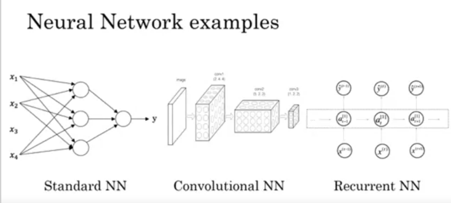

- Compare structured data & unstructured data:

|   | Structured data  | Unstructured data  |
|---|---|---|
| Categorized  | quantitative data | qualitative data  |
| Examples  | Databases, tables  | Images, video, audio & text  |

### Why is deep learning taking off?
- Deep learning is taking off for 3 reasons:
    - **Data**: scale drives deep learning progress.

        
    
        - For small data, Neural Networks & traditional learning algorithms provide the same performance.
        - With huge amounts of data, 
            - The traditional algorithms stops improving it's performance.
            - Large Neural Networks are getting better.
    
    - **Computation**:
        - GPUs
    
    - **Algorithms**:
        - The algorithmic innovations makes neural networks run much faster.
        - An example: compare 2 activation functions sigmoid function & ReLU 

=> The fast computation speeds up the processing of training networks. 

## Neural Networks Basics

### Binary classification
- Consider an example:
    - An image (RGB) represented by a features vector X. 
    - **Goal** (predict): the image contains cats (1) or not (0)

- Notation: 
    - (x, y): a single training example. 
        - $x \in R^{n_{x}}$
        - $y \in {0, 1}$
    - *m*: number of training examples. 
        - ${(x^{(1)}, y^{(1)}), (x^{(2)}, y^{(2)}), ..., (x^{(m)}, y^{(m)})}$
        - $m_{training}$: number of training examples.
        - $m_{test}$: number of testing examples.
    - **X** is design matrix (model matrix) which is simply columns of out input vectors $x^{(i)}$. 
        - **X** as rows of transposed input vectors.
        - $X = [x^{(1)} x^{(2)} ... x^{(m)}]$
        - $X \in R^{n_{x} * m}$
    - **Y** is output vector:
        - $Y = [y^{(1)} y^{(2)} ... y^{(m)}]$
        - $Y \in R^{1 * m}$

### Logistic Regression
- Problems:
    - Give x - an input vector, want predict $\hat{y}$ - the probability of the input examples class: $\hat{y} = P(y=1|x)$
- Propose:
    - The parameter of our model: $w \in R^{n_x}, b \in R$
    - The output: $\hat{y} = \sigma(w^{T}x + b)$
        - $\sigma(z) = \frac{1}{1 + e^{-z}}$: the sigmoid function

- Sigmoid function: 

    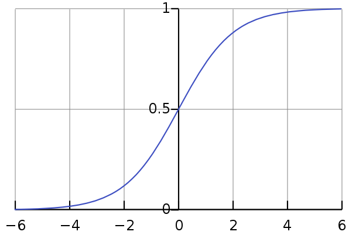

    - If *z* is very large -> $e^{-z}$ will be close 0 -> $\sigma(z)$ is very close to 1.
    - If *z* is very large negative -> $e^{-z}$ will grow very large -> $\sigma(z)$ is very close to 0.

### Logistic Regression cost function
- Remark, our prediction for an example $x^{(i)}$ is $\hat{y} = \sigma(w^{T}x + b)$, where $\sigma(z) = \frac{1}{1 + e^{-z}}$
    - **Goal**: give ${(x^{(1)}, y^{(1)}), (x^{(2)}, y^{(2)}), ..., (x^{(m)}, y^{(m)})}$, want $\hat{y}^{(i)} \approx y^{(i)}$
    

- Loss function:
    - A measure of how good the prediction model  $\hat{y}$ when the true label is $y$. 
    - Loss (error) function: 
        $l(\hat{y}, y) = -(ylog\hat{y} + (1-y)log(1-\hat{y})$
    - If y=1:  $l(\hat{y}, y) = -log\hat{y}$. Thus, the loss approaches 0 as $\hat{y}$ approaches 1.
    - If y=0:  $l(\hat{y}, y) = -log(1 - \hat{y})$. Thus, the loss approaches 0 as $\hat{y}$ approaches 0.

- Loss function & cost function:
    - The loss function as computing the error for a single training example.
        $l(\hat{y}, y) = -(ylog\hat{y} + (1-y)log(1-\hat{y})$
    - The cost function as the average of the loss functions of the entire training set. 
        $J(w, b) = \frac{1}{m} \sum_{i=1}^{m}l(\hat{y}^{(i)}, y^{(i)}) = -\frac{1}{m} \sum_{i=1}^{m}(y^{(i)}log(\hat{y}^{(i)}) + (1 - y^{(i)})log(1 - \hat{y}^{(i)}))$

### Gradient Descent
- Recap 
    - logistic regression:
    
        $\hat{y} = \sigma(w^{T}x + b)$, where $\sigma(z) = \frac{1}{1 + e^{-z}}$ 

    - Cost function:

        $J(w, b) = \frac{1}{m} \sum_{i=1}^{m}l(\hat{y}^{(i)}, y^{(i)})$

    - **Goal**: find w, b that minimize J(w, b)

- Plot the **cost function**

    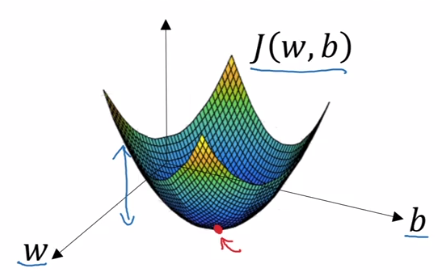

    - Analysis the plot:
        - Horizontal axes: w & b
        - Vertical axes: J(w, b)
        - The height of the surface above the horizontal axes is *cost function value*.
    - Conclusion, we need to find the values of parameters w, b at the lowest point of this surface which the average loss is at it's minimum.

- Gradient Descent Algorithm
    - Step 1: Initialize w, b to some random values
    - Step 2: 

        $ w := w - \alpha\frac{dJ(w, b)}{dw}$

        $ b := b - \alpha\frac{dJ(w, b)}{db}$

        - $d$: the derivative of a function of only 1 variable.
        - $\delta$: the partial derivative of a function with $\geq 2$ variables.

### Derivatives
- Intuition about derivatives
    - An example: f(a)=3a. Then f(a)=6 when a=2. If a=2.001, what happends to f(a) ? 

        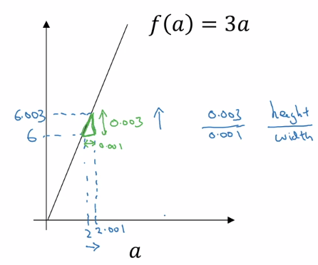

    - inspect the triangle formed by performing the nudge, the slope of the function between a & (a + 0.01) is 3. 
    - The derivative of f(a) with reference to a is 3 ~ $\frac{df(a)}{da}=3$ 

### Computation Graph
- A **computation graph** organizes a series of computations into left-to-right and right-to-left passes.
    - Consider an example: J(a, b, c) = 3(a + bc). This computation includes 3 discrete steps:
        - Step 1: u=bc
        - Step 2: v=a+u
        - Step 3: J = 3v

            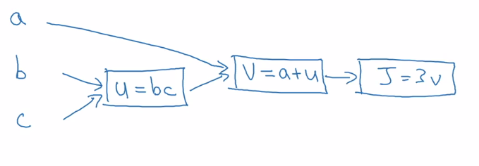

    - A *forward pass* through the graph is represented by *left-to-right*
    - A *backwards pass* through the graph is represented by *right-to-left* which is a natural way to represent the computation of our derivatives.
    
### Derivatives with a computation graph
- Using computation graph to compute the partial derivatives of J.
    
    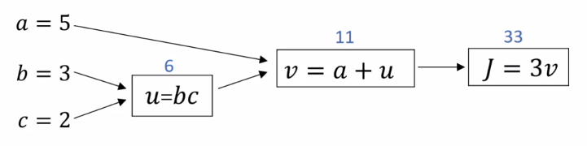

    - To computing derivatives, a small change to v results in a change to J of *3 times* that small change. So:

        $\frac{dJ}{dv} = 3$

    - Noting a small change to a results in a change to J of *3 times* that small change. So: 

        $\frac{dJ}{da} = 3$

    - Changing a, we change v, the magnitude of this change is $\frac{dv}{da}$. Through this change in v, we change J, the magnitude of this change is $\frac{dJ}{dv}$. Using the *chain rule*:
    
        $\frac{dJ}{da} = \frac{dJ}{dv}\frac{dv}{da} = 3*1 = 3$

        $\frac{dJ}{du} = \frac{dJ}{dv}\frac{dv}{du} = 3*1 = 3$

        $\frac{dJ}{db} = \frac{dJ}{dv}\frac{dv}{du}\frac{du}{db} = 3*1*2 = 6$

        $\frac{dJ}{dc} = \frac{dJ}{dv}\frac{dv}{du}\frac{du}{dc} = 3*1*3 = 9$

### Logistic Regression Gradient Descent
- Logistic regression recap:
  
    $z = w^{T}x + b$
    
    - Y predict:
        
        $\hat{y} = a = \sigma(z) = \frac{1}{1 + e^{-z}}$

    - Loss function:

        $l(a, y) = -(ylog(a) + (1-y)log(1-a))$

- Assume, we have 2 features: $x_1 , x_2$. Our computation graph:
    
    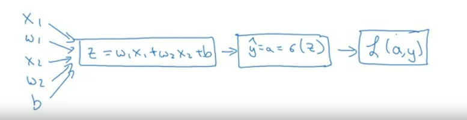

    - **Goal**: modify $w_1 , w_2 , b$ to minimum $l(a, y)$.

- Logistic regression derivatives:
    - Backwards to compute the derivatives:

        $da = \frac{dl(a, y)}{da} = \frac{-y}{a} + \frac{1-y}{1-a} , (1)$
        
        $dz = \frac{dl}{dz} = \frac{dl}{da} \frac{da}{dz} , (2)$

        $\frac{dl}{da} = \frac{-y}{a} + \frac{1-y}{1-a} = \frac{-y + ay + a - ay}{a*(1-a)}, (2.1)$

        $\frac{da}{dz} = (\frac{1}{1 + e^{-z}})^{'} = \frac{- 1*(e^{-z})^{'}}{(1 + e^{-z})^{2}} = \frac{(-1)*(-1)*e^{-z}}{(1 + e^{-z})^{2}} = \frac{1}{1 + e^{-z}} \frac{e^{-z}}{1 + e^{-z}} = a*(1 - a), (2.2)$

        $(2) \Leftrightarrow a*(1-a) \frac{a - y}{a*(1-a)} = a - y$

        $dw_1 = \frac{\partial l}{\partial w_{1}} = \frac{\partial l}{\partial z} \frac{\partial z}{\partial w_1} = x_1*dz$

        $dw_2= x_2*dz$

        $db = dz$

    - Update the parameters:
        
        $w_1 := w_1 - \alpha \frac{dl(a, y)}{dw_1}$

        $w_2 := w_2 - \alpha \frac{dl(a, y)}{dw_2}$

        $b := b - \alpha \frac{dl(a, y)}{b}$

### Gradient Descent on *m* Examples
- Remind the logistic regression cost function:
    
    $J(w, b) = \frac{1}{m} \sum_{i=1}^{m}l(\hat{y}^{(i)}, y^{(i)}) = -\frac{1}{m} \sum_{i=1}^{m}(y^{(i)}log(\hat{y}^{(i)}) + (1 - y^{(i)})log(1 - \hat{y}^{(i)}))$

    $\hat{y}^{(i)} = \sigma(z^{(i)}) = \sigma(w^{T}x^{(i)} + b)$

- For *m* examples, the derivatives with $(x^{(i)}, y^{(i)})$:
  
    $\frac{\partial J(w, b)}{\partial dw_1} = \frac{1}{m} \sum_{i=1}^{m}\frac{\partial l(\hat{y}^{(i)}, y^{(i)})}{\partial w_{1}} = \frac{1}{m} \sum_{i=1}^{m} dw_{1}^{(i)}$

    $\frac{\partial J(w, b)}{\partial dw_2} = \frac{1}{m} \sum_{i=1}^{m}\frac{\partial l(\hat{y}^{(i)}, y^{(i)})}{\partial w_{2}} = \frac{1}{m} \sum_{i=1}^{m} dw_{2}^{(i)}$

    $\frac{\partial J(w, b)}{\partial db} = \frac{1}{m} \sum_{i=1}^{m}\frac{\partial l(\hat{y}^{(i)}, y^{(i)})}{\partial b}$

- The pseudo-code for gradient descent on *m* examples of *n* features:
    
    - Step 1: Initialize $J=0; dw_1 = dw_2 = ... = dw_n = 0; db = 0$
    - Step 2: Loop over training examples:
        - for i = 1 to m:
      
            $z^{(i)} = w^{T}x^{(i)} + b$

            $a^{(i)} = \sigma(z^{(i)})$

            $J += -[y^{(i)}log(a^{(i)}) + (1 - y^{(i)})log(1 - a^{(i)})]$

            $dz^{(i)} = a^{(i)} - y^{(i)}$

            - for j = 1 to n:

                $dw_{j} += x_{j}^{(i)}dz^{(i)}$

            $dwb += dz^{(i)}$

        - Take the average of cost function & gradients:

        $J /= m; dw_{j} /= m; db /= m$

    - Step 3: Use derivatives to update parameters:

        $w_{i} := w_{i} - \alpha dw_i$

        $b := b - \alpha db$

## Shallow neural networks

### Neural Networks Overview
- The networks looks like:

    | Network  | Computation graph  |
    |---|---|
    | 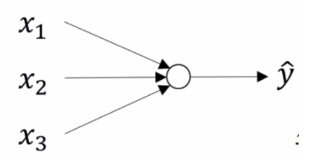  | 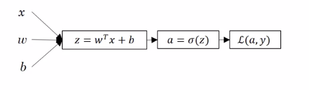  |
    

- A neural networks looks like:

    | Neural Network  | Computation graph  |
    |---|---|
    | 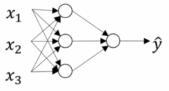  | 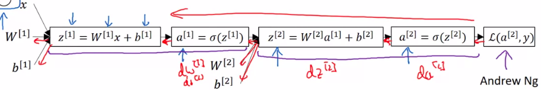  |

### Neural Networks Representation
- Consider a single neural networks:

    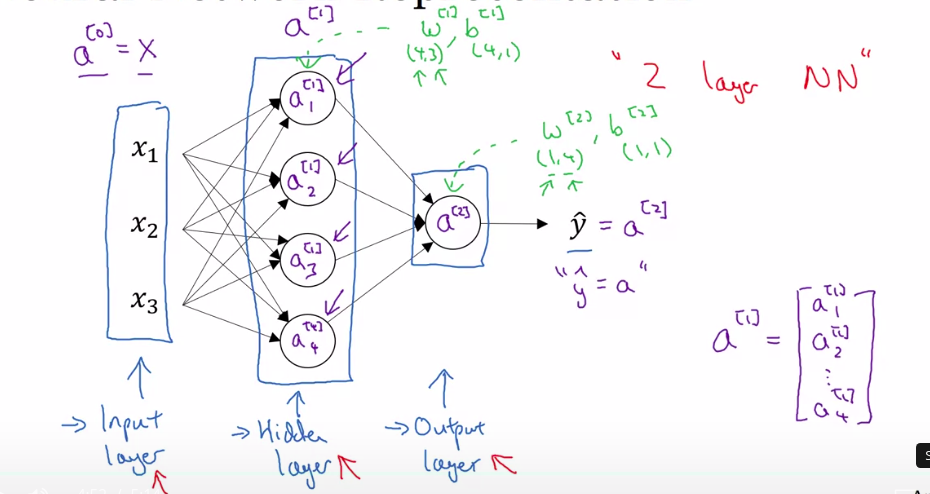

    - Notation:
        - $x_1, x_2, x_3$: the **input features** constitutes **input layer**
        - The **output layer**: is responsible for generating the predict value $\hat{y}$
        - The **hidden layers**: any layer in between input layer & output layer.
            - The *true values* of these hidden units is not observed in the training set.
        - The output values of a layer *l* denoted as a column vector $a^{[l]}$, where "a" stands for *activation*.
        - The parameters of layer *l* denoted $W^{[l]}$ & $b^{[l]}$
        - $a^{[l]}_{i}$: 
          - *l* - the layer $l^th$
          - *i* - the node $i^{th}$
      
    - **Note**: the number of layers in neural networks not consists the input layer.

### Computing a Neural Network's Output
- Consider the first nodes in the hidden layer:
    
    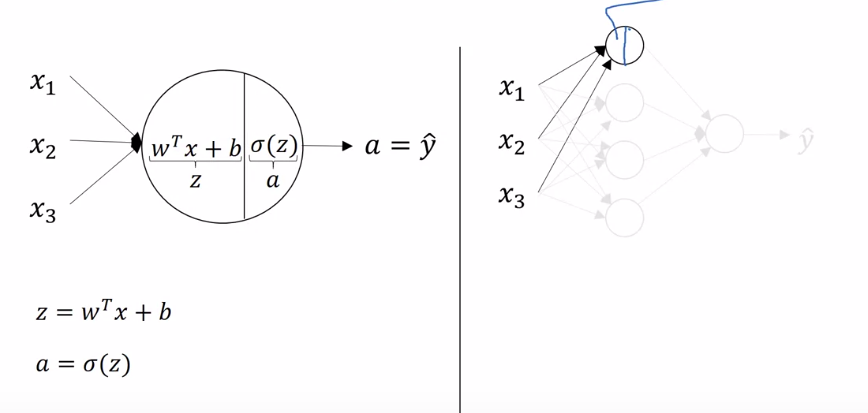 

    $z^{[l]}_{1} = w^{[1]T}x + b^{[1]}$
    
    $a^{[1]}_{1} = \sigma(z^{[l]}_{1})$

- So, all the nodes in the hidden layer:

    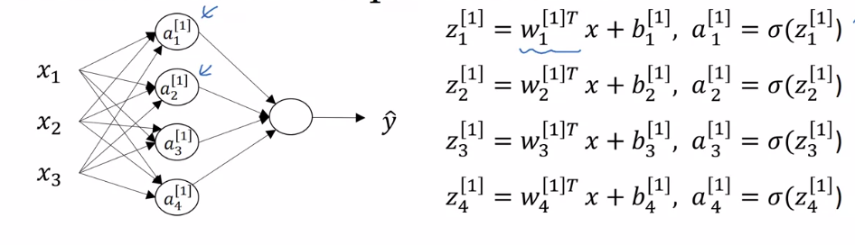

    - Vectorization the computation of $z^{[l]}$
        - Matrix **X**: (3, 1)
        - Matrix **W**: (3, 4) & $W^{T}$: (4, 3)
        - Matrix **b**: (4, 1)
        - Matrix $a^{[l]}$: (4, 1)

- All the computations:

    $z^{[1]} = W^{[1]}a^{[0]} + b^{[1]}$

    - $W^{[1]} - (4, 3); a^{[0]} - (3, 1); b^{[1]} - (4, 1); z^{[1]} - (4, 1)$

    $a^{[1]} = \sigma(z^{[1]})$ 

    - $a^{[1]} - (4, 1)$  

    $z^{[2]} = W^{[2]}a^{[1]} + b^{[2]}$ 

    - $W^{[2]} - (1, 4); a^{[1]} - (4, 1); b^{[2]} - (1, 1); z^{[2]} - (1, 1)$

    $a^{[2]} = \sigma(z^{[2]})$

- Other example:
  
    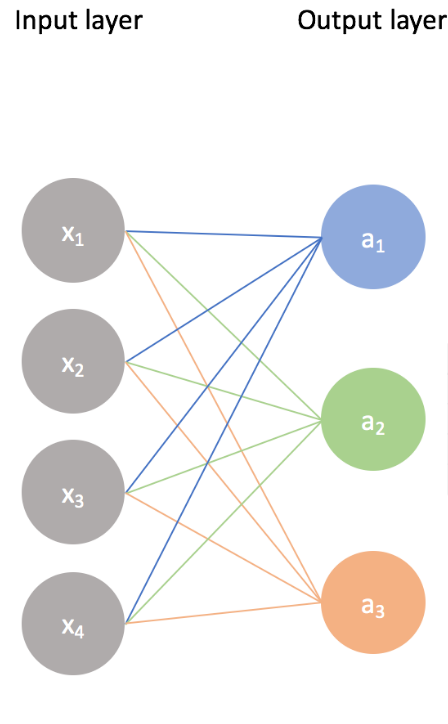

    - $z^{[1]}_1 = w^{[1]}x_1 + w^{[2]}x_2 + w^{[3]}x_3 + w^{[4]}x_4 + b_1 ; a^{[1]}_{1} = \sigma(z^{[1]}_1)$

    - $z^{[1]}_2 = w^{[1]}x_1 + w^{[2]}x_2 + w^{[3]}x_3 + w^{[4]}x_4 + b_2 ; a^{[1]}_{2} = \sigma(z^{[1]}_2)$
    
    - $z^{[1]}_3 = w^{[1]}x_1 + w^{[2]}x_2 + w^{[3]}x_3 + w^{[4]}x_4 + b_3 ; a^{[1]}_{3} = \sigma(z^{[1]}_3)$

    - $a^{[0]} - (4, 1); W^{[1]} - (3, 4);  b^{[1]} - (3, 1); z^{[1]} - (3, 1)$

### Vectorizing across multiple examples
- Notation:
    - the activation values of layer *l* for input example *i* is:  $a^{[l](i)}$

- Propose, we have *m* training examples & 2 layers, so we can used a vectorized approach to compute all *m* predictions.
    - for i=1 to m:
        
        $z^{[1](i)} = w^{[1]}x + b^{[1]}$  

        $a^{[1](i)} = \sigma(z^{[1](i)})$

        $z^{[2](i)} = w^{[2]}a^{[1](i)} + b^{[2]}$ 

        $a^{[2](i)} = \sigma(z^{[2](i)})$

  

### Activation functions
- Activation function are used to determine the firing of neurons in a neural network. Given a linear combination of inputs & weights from previous layer, the activation function controls how we'll pass that information on to the next layer.
- Properties:
    - The **non-linear** allows neural network to learn non-linear relationships in the data.
    - **Differentiability** allows neural network to back-propagate the model's error when training to optimize the weights.

-  hh
  
|   | Sigmoid  | Tanh  | Rectified Linear Unit (ReLU)  |   |
|---|---|---|---|---|
| Formula  | $\sigma(z) = \frac{1}{1 + e^{-z}}$  | $tanh(z) = \frac{e^{z} - e^{-z}}{e^{z} + e^{-z}}$  | $ReLU(z) = max(0, z) $ |   |
| Range  | $0 \leq \sigma(z) \leq 1$  | $-1 \leq tanh(z) \leq 1$  | $0 \leq tanh(z) \leq infinity$  |   |
| Pros  | Easy to compute  | The mean of tanh func is closer to zero  | Not expensive operations (simply thresholding)  |   |
| Cons  | Vanishing gradient at edges  | Vanishing gradient at edges  | Can be fragile during training (dying ReLU)  |   |

- *Vanishing gradient at edges*: If the input is too small or high, the slope will be near zero

### Why do you need non-linear activation functions ? 
- The purposed of the activation function is to introduce *non-linear into the network* which allows you to model a response variable that varies non-linearly with its explanatory variables.

## Gradient descent for Neural Networks
- Consider a simple 2-layer neural network. Recall:
  
    - Parameters: $W^{[1]}, b^{[1]}, W^{[2]}, b^{[2]}$
    
    - Number of features: $n_x = n^{[0]}$
    
    - Number of hidden units: $n^{[1]}$ 

    - Number of output units: $n^{[2]}$

- Dimensions:
    - $W^{[1]}$: $(n^{[1]}, n_x)$

    - $b^{[1]}$: $(n_x, 1)$

    - $W^{[2]}$: $(n^{[2]} , n^{[1]})$
  
    - $b^{[2]}$ $(n^{[2]}, 1)$

- Cost function:
  
    $J(W^{[1]}, b^{[1]}, W^{[2]}, b^{[2]}) = \frac{1}{m} \sum^{m}_{i=1}l(\hat{y}, y)$

- Gradient Descent for neural networks:
    

# Reference:

[1] https://www.jeremyjordan.me/intro-to-neural-networks/

[2] https://www.ibm.com/cloud/learn/supervised-learning

[3] https://johngiorgi.github.io/deeplearning.ai-coursera-notes/neural_networks_and_deep_learning/