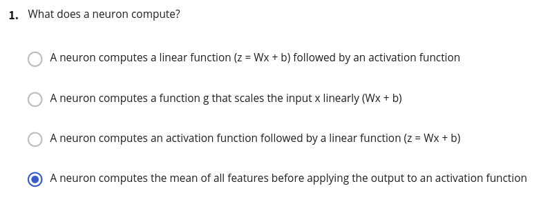

# Quizs
## Table of contents

- [Quizs](#quizs)
  - [Table of contents](#table-of-contents)
  - [Neural Network Basics](#neural-network-basics)

## Neural Network Basics

  - A neuron computes a linear function (z = wx + b) followed by an activation function.

