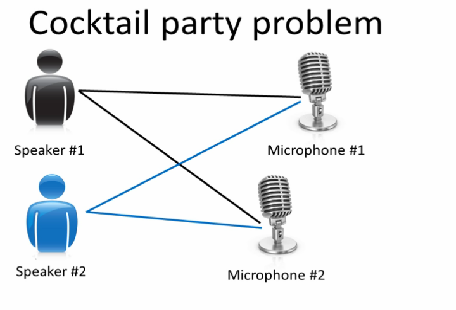
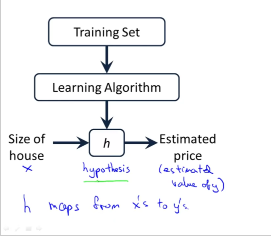
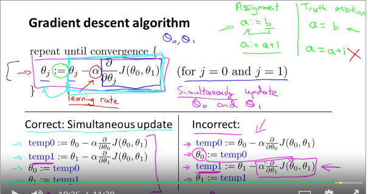
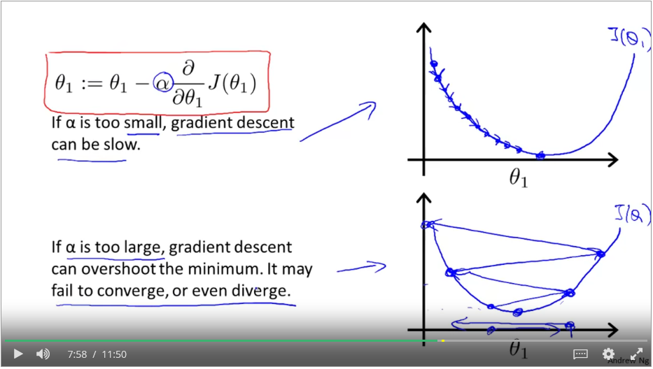

# Introduction

## 1. What is Machine Learning ?
+ Field of study that gives computers the ability to learn without being explicitly(~details) programmed.
+ A computer program is said to learn from experience *E* with respect to some class of taks *T* and performance measure *P*. If its performance at tasks in T, as measured by P, improves with experience E.

## 2. Supervised Learning
+ Consider example: Housing price prediction

    

    - Input data: data regarding housing price & how they relate to size in feet.
    - Output: predict housing price if know house's size.
    - Solution:
        - Consider 2 lines: straight line through data & order polynomial.
        - *Q*: How to chose straight or curved line ? 
    - Analysis: 
        - Provide: the correct datasets.
        - The algorithm should produce more right answers based on new training data.
+ *Regression problem*:
    - predict continuous valued output.
    - No real discrete delineation.
+ *Classification problem*
    - Classify data into one of two discrete classes.
    - In classification, can have a discrete number of possible values for the output.

## 3. Unsupervised learning 
+ Approach problems with little or no idea what our results should look like.
    - Can derive/get structure from data where we don't necessarily know the effect of the variables.
        - clustering the data based.
+ Get **unlabeled data**.
    - cluster data into groups: *clustering algorithm*

## 4. Cocktail party algorithm
+ Cocktail party problem. Suppose:

    

    - Lots of overlapping voices. 
        - two people talking & microphones at difference distances from speakers.
    - Algorithm processes audio recording:
        - Determines audio sources
        - Separates out the two sources
    - Algorithm format:

        $[W, s, v] = svd((repmat(sum(x.*x, 1), size(x, 1), 1).*x)*x')$
    
## 5. Linear Regression
### 5.1 Analysis linear regression problem
+ Input data: training set (housing price data).
    - Notation:
        - m: number of training examples
        - x's: input variables/features
        - y's: output variable 'target' variables.
        - (x, y): single training example
        - $(x^{i}, y^{j})$: special example ($i^{th}$ training example)
            - i: an index of training set.
    - How do we used training set ?
        - Step 1: Take training set.
        - Step 2: Pass into a learning algorithm.            
        - Step 3: Algorithm outputs a function (denotation: *h - hypothesis*). Predict the estimated value of Y.
            - Hypothesis: $h_{\theta}(x) = \theta_{0} + \theta_{1}x$
                - $\theta_{i}$: **parameters**
                - Linear regression with one variable: *univariate linear regression*

    - Visualization hypothesis:

        

### 5.2 Cost function
+ **Idea**: choose $\theta_{1}, \theta_{0}$ so that $h_{\theta}(x)$ is close to y for training examples (x, y).

+ **A cost function**: figure out/look for how to fit the best straight line to our data.
+ Based on training set: look for parameters which makes the straight line.
    - Uses $h_{\theta}(x)$: try to convert the x into y.
    - Meaning: minimize squared different between predict value and ground truth house price.

        $(h_{\theta}(x) -y)^{2}$
    - The **cost function** with all training examples: 
        
        $J(\theta_{0}, \theta_{1}) = \frac{1}{2m} \sum_{i=1}^{m}(h_{\theta}(x) -y)^{2}$
+ The squared of the error cost function works well for problems for most regression programs.

### 5.3 Summary
+ **Hypothesis**: as like prediction machine. Throw an *x* value to get a putative (~ consider as correct result) *y* value.
+ **Cost**: A method uses training data to determine values for parameters $\theta$ which make the hypothesis as accurate as possible.
    - the *squared error cost function*

## 6. Gradient Descent Algorithm
### 6.1 Overview
+ Idea:
    - Minimize cost function J
    - Gradient descent: used all over machine learning for minimization.
+ Problem:
    - Input: $J(\theta_{0}, \theta_{1}, ... \theta_{n})$
    - Output: get min $J(\theta_{0}, \theta_{1}, ... \theta_{n})$)$
+ How does it work ?
    - Step 1: initial guesses:
        - Start at some point. Ex: (0, 0, ..., 0)
        - Keeping changing $\theta_{0}, \theta_{1}, ... \theta_{n}$ a little bit to try & reduce $J(\theta_{0}, \theta_{1}, ... \theta_{n})$.
    - Step 2: Each time change the parameters, we select the gradient which reduces $J(\theta_{0}, \theta_{1}, ... \theta_{n})$ the most possible.
    - Step 3: Stop condition
        - If: the converge to a local minimum -> out the loop.
        - Else: repeat.
+ Notes: start point efficient the local minimum (position & value)

### 6.2 A more formal definition
+ Repeat until *convergence*:

    $\theta_{j} := \theta_{j} - \alpha\frac{\partial}{\partial\theta_{j}}J(\theta_{0}, \theta_{1}, ... \theta_{n})$

    - Notation:
        - $\alpha$: learning rate. 
        - $\frac{\partial}{\partial\theta_{j}}J(\theta_{0}, \theta_{1}, ... \theta_{n})$: derivative term.
        - *:=* : assignment operator.
        - *=*: true assertion (~ make sure). *Ex: a = a + 1 ~ wrong*

    - Simultaneous (~ parallel) update $\theta_{0}, \theta_{1}$.
        
        $temp0 := \theta_{0} - \alpha\frac{\partial}{\partial\theta_{0}}J(\theta_{0}, \theta_{1})$

        $temp1 := \theta_{1} - \alpha\frac{\partial}{\partial\theta_{0}}J(\theta_{0}, \theta_{1})$

        $\theta_{0} := temp0$

        $\theta_{1} := temp1$

    

+ Learning rate: control how big a step downhill with creating descent.
    - If too small: 
        - take tiny steps & too long
    - If too large:
        - Can overshoot the minimum & fail to converge.
    
    

### 6.3 Gradient Descent Intuition
+ Consider minimize function: 
    $\underset{\theta_{1}}{\text{minimize}} J(\theta_{1})$

    - *Partial derivative*: Use partial derivative when we have multiple variables but only derive 1 variable.
    - *Derivative*: derive all variables.

+ **Derivative term meaning**:
    - Takes the tangent (a straight line touches a curve at only a point) & look at the slope of the line.
    - Moving towards the minimum to reduce $J_{\theta}$ value
    - Gradient descent will automatically take smaller steps. So no need to decrese $\alpha$ over time.
    - Gradient descent can converge to a local minimum, even with the learning rate $/alpha$ fixed.

        

## 7. Linear regression with gradient descent
+ Consider Gradient descent algorithm and Linear Regression Model:

+ Apply gradient descent to minimize the squared error cost function $J(\theta_{0}, \theta_{1})$
+ Partial derivate:
$\frac{\partial}{\partial\theta_{j}}J(\theta_{0}, \theta_{1}) = \frac{\partial}{\partial\theta_{j}}\frac{1}{2m} \sum_{i=1}^{m}(h_{\theta}(x^{(i)}) -y^{(i)})^{2} =\frac{\partial}{\partial\theta_{j}}\frac{1}{2m} \sum_{i=1}^{m}(\theta_{0} + \theta_{1}(x^{(i)}) -y^{(i)})^{2}$

+ Calculate partial derivate:
    - $j=0: \frac{\partial}{\partial\theta_{0}}J(\theta_{0}, \theta_{1}) = \frac{1}{m} \sum_{i=1}^{m}(\theta_{0} + \theta_{1}(x^{(i)}) -y^{(i)})$
    - $j=1: \frac{\partial}{\partial\theta_{1}}J(\theta_{0}, \theta_{1}) = \frac{1}{m} \sum_{i=1}^{m}(\theta_{0} + \theta_{1}(x^{(i)}) -y^{(i)}).(x^{(i)})$

+ Apply Gradient descent algorithm:
    - repeat until convergence:

        $\theta_{0} := \theta_{0} - \alpha\frac{\partial}{\partial\theta_{0}}J(\theta_{0}, \theta_{1}) := \theta_{0} - \alpha\frac{1}{m}\sum_{i=1}^{m}(h_{\theta}(x^{(i)}) -y^{(i)})$

        $\theta_{1} := \theta_{1} - \alpha\frac{\partial}{\partial\theta_{1}}J(\theta_{0}, \theta_{1}) := \theta_{1} - \alpha\frac{1}{m}\sum_{i=1}^{m}(h_{\theta}(x^{(i)}) -y^{(i)}).(x^{(i)})$

### 7.1 Batch Gradient Descent
+ **Batch**: each step of gradient descent uses all the training examples.
    - Each step, we look at all the training data. The computing over *m* training examples.
    - Sometime, we just lock at small data subsets.
  