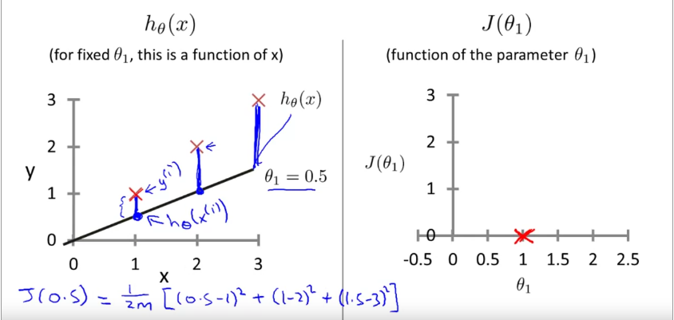
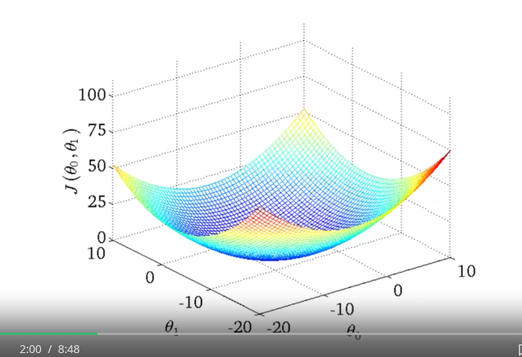
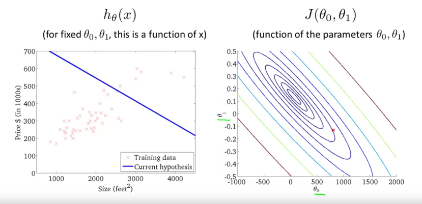

# The Cost Function

## Recap: 
+ Hypothesis:

    $h_{\theta}(x) = \theta_{0} + \theta_{1}x$

+ Parameters:

    $\theta_{1}, \theta_{0}$

+ Cost Function:

    $J(\theta_{0}, \theta_{1}) = \frac{1}{2m} \sum_{i=1}^{m}(h_{\theta}(x^{(i)}) -y^{(i)})^{2}$

+ Goal:

    $\underset{\theta_{1}, \theta_{0}}{\text{minimize}} J(\theta_{0}, \theta_{1})$

## Cost function - a deeper look
+ *Determines* parameters and then get the value of hypothesis.
+ The optimzation objective for the learning algorithm is find the value of $\theta_{1}$ which minimizes $J(/theta_{1})$.

## Cost function Intuition 
+ Consider:
    - the hypothesis function $h_{\theta}(x)$:
        - Fixed $\theta_{1}$ & this function of x
        - $J(/theta_{1})$ 
    - a cost function $J(/theta_{1})$:
        - This function of parameter $/theta_{1})$

    

+ Consider 2 variables $\theta_{1}, \theta_{0}$: 
    - **Contour plots**: A cost function that maybe looks like:

    

    - Compare hypothesis function & cost function:

    
